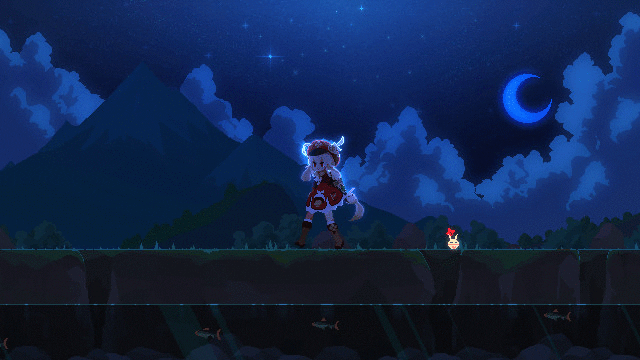

# Hi there, I'm Assia  👋

  

🎓 **Computer Science & AI Engineering Student** 
💡 Passionate about Software Development, Machine Learning, and Building Innovative Tech Solutions.

🔗 **Explore my Portfolio:** [asmegnou.github.io](https://asmegnou.github.io/)

---

### 🚀 Tech Stack & Skills

#### **Languages & Frameworks**

#### **AI & Data Science**

#### **Tools & DevOps**

---

### 🌐 Connect with me
- 💼 **LinkedIn:** [Assia Megnououche](https://www.linkedin.com/in/assia-megnounif-788b44269/)
- 🌐 **Portfolio:** [asmegnou.github.io](https://asmegnou.github.io/)
- ✉️ **Contact:** [Get in touch](https://asmegnou.github.io/#contact)

---

### 📊 GitHub Overview

  
  

